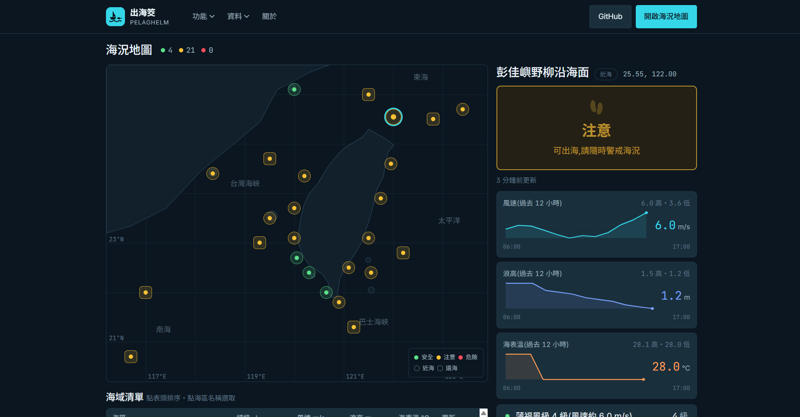

# 海況回報 App(seastate-app)

**🌊 線上版:[pelaghelm.vercel.app](https://pelaghelm.vercel.app/)**

給漁民使用的海況 App。整合中央氣象署(CWA)與國際海象資料(Open-Meteo / OpenWeather),依風速、浪高與官方警特報,將指定海域算出**安全 / 注意 / 危險**三級評級。規劃中的後續階段將加入 GPS 定位、文字回報與地圖,形成漁民互助的即時海況地圖。

| 頁面 | 網址 |
| ---- | ---- |
| 首頁 | <https://pelaghelm.vercel.app/> |
| 海況地圖 | <https://pelaghelm.vercel.app/map> |
| 關於 / 聯絡 | <https://pelaghelm.vercel.app/about> |
| 狀態展示(開發用) | <https://pelaghelm.vercel.app/demo> |

## 畫面預覽

> 圖片放在 [`docs/screenshots/`](docs/screenshots/),檔名約定與規格見該資料夾的 [README](docs/screenshots/README.md)。

### 首頁


### 海況地圖



選取海域後的詳情面板與 12 小時走勢圖:


## 目前進度

**M1(海況資料整合)、M2(危險判斷後端)、M3(Supabase 快取層)、M4(前端整站 + 歷史資料)已完成。海況分區已從 4 個粗略區域擴充為 25 個(17 近海 + 8 遠海)。**

後端:

- 風速資料來自 OpenWeather
- 浪高與海表溫資料來自 Open-Meteo Marine
- 官方警特報來自中央氣象署(CWA)
- `/api/sea-conditions` 讀 Supabase 快取,由 `POST /api/cron/refresh`(cron-job.org 每 30 分觸發)並行寫入 25 個 zone
- 每輪 refresh 另 append `sea_condition_history`(保留 48 小時),供走勢圖使用
- 綜合以上資料與可調整閾值,判定海域危險等級

前端(全部為 Server Component,零 Client Component;選區/排序/狀態切換走 query string):

- `/` — landing 首頁
- `/map` — 海況地圖:台灣 SVG 海圖 + 25 區標記 + 詳情面板 + 12 小時走勢圖 + 可排序海域清單
- `/about` — 關於 / 聯絡 / roadmap
- `/demo` — 五種資料狀態切換展示(開發用)

尚無 Auth。設計系統見 [docs/DESIGN.md](docs/DESIGN.md)。

**前端已接真資料**:頁面透過 `src/lib/data/sea-conditions.ts` 直接讀 Supabase 快取(Server Component 內不繞自家 HTTP API),邏輯與 `/api/zones`、`/api/history` 完全一致。`/demo` 仍刻意使用 `src/lib/mock/sea-conditions.ts`——它要展示「全來源失敗」等真資料無法隨選重現的狀態。

兩份 migration(`sea_condition_cache`、`sea_condition_history`)皆已套用完畢。走勢圖的資料由 cron 每輪 append,**需累積 2 筆以上才畫得出線**;只有 1 筆時圖表誠實顯示當前值與「累積中,尚不足以畫出走勢」。

## 技術棧

- Next.js 16(App Router, TypeScript, Tailwind v4)
- Zod(API 輸入驗證)
- Supabase(PostgreSQL + PostGIS)
- Vitest(單元測試,30 個)
- Node 22

## 開發 / 測試

```bash
npm install
npm run dev        # 啟動開發伺服器(localhost:3000)
npm run test       # 跑 Vitest 單元測試
npx tsc --noEmit   # type check
npx eslint .       # lint
```

需要在專案根目錄自建 `.env.local`(已被 `.gitignore` 排除,不會進版控):

```bash
OPENWEATHER_API_KEY=        # openweathermap.org 免費方案
CWA_API_KEY=                # opendata.cwa.gov.tw 會員取得
SUPABASE_URL=               # Supabase 專案 URL
SUPABASE_SERVICE_ROLE_KEY=  # service role,僅 server 端使用,切勿加 NEXT_PUBLIC_ 前綴
CRON_SECRET=                # 自訂隨機字串,cron-job.org 需帶同一組
```

## API

```
GET /api/sea-conditions?lat={緯度}&lng={經度}
```

回傳指定座標所屬海域(25 分區之一)的海況資料與危險評級:

```json
{
  "condition": { "...": "..." },
  "danger": { "level": "safe | caution | danger", "factors": ["..."] },
  "fetched_at": "ISO 時間字串",
  "staleness_seconds": 0,
  "is_stale": false
}
```

```
GET /api/zones
```

25 區當前海況總覽(地圖 / 清單用),只讀快取、不觸發 coldFetch。回傳 `{ zones: ZoneSummary[] }`。

```
GET /api/history?zoneId={海區代號}&hours={小時數}
```

單一海區過去 N 小時的歷史資料(走勢圖用,預設 12、上限 48)。回傳 `{ zone_id, hours, points }`,最舊在前。

```
POST /api/cron/refresh
Authorization: Bearer <CRON_SECRET>
```

並行刷新 25 個 zone 的快取,回傳 `{ refreshed, skipped, failed }`。由 cron-job.org 每 30 分鐘觸發,非公開端點(以 `timingSafeEqual` 比對 bearer token)。

範例:

```bash
curl "http://localhost:3000/api/sea-conditions?lat=24.0&lng=119.5"
```

> 測試用經緯度請選外海座標(例如 `24.0,119.5`、`22.5,120.0`、`25.3,122.0`),陸地座標的浪高資料會是 `null`。

## 注意事項

- 危險判定閾值皆為保守預設值,非法定標準,App 需顯示免責聲明。
- 25 個 zone 的 `warningArea`(對應 CWA 海上警特報海區字串)目前全部為空字串——原本串接的 `W-C0033-002` 實測為**陸上**縣市警特報,正確的海上警特報 resource_id 尚未找到。在補上之前,官方警報 override 這條路徑實質停用(風速 / 浪高評級不受影響)。
- `supabase/migrations/20260723090000_m4_sea_condition_history.sql` **尚未在 Supabase 專案上執行**。套用前 cron refresh 會回 `historyError`(refresh 本體不受影響),`/api/history` 會回 502。
- 前端頁面目前使用 mock 資料,尚未接上真 API。
